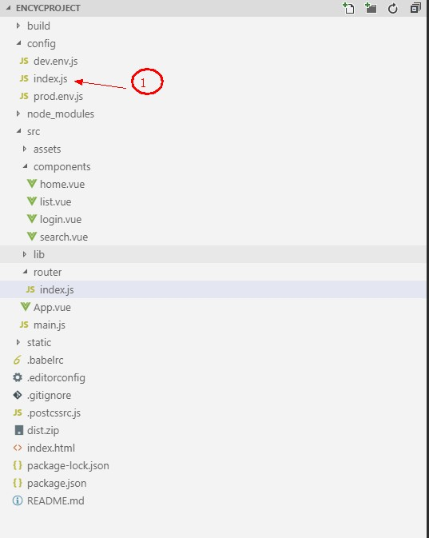
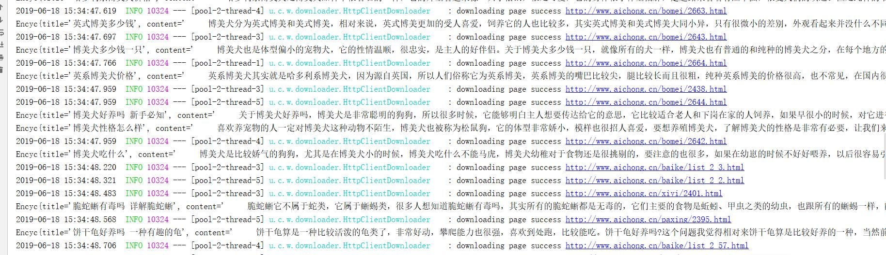

</img>
# EncycProject
> EncycProject项目使用现在流行的前后端分离技术；此项目创作目的是实践。利用此项目快速搭建环境和快速入门。该项目的主线是建立宠物社区网站。目前该项目完成第一个模块：宠物百科；剩余模块陆续开发中。（此项目可以变更，第一模块耦合度低）
---
### 项目模块
- **宠物百科**：利用爬虫爬取相关数据，建立中心库，搜索引擎使用的solr7  
    -  **模块的项目演示**
    >如下图 [图示链接](resource/img/project.gif)
    

- 敬请期待。。。
---
## 1 项目的体系结构
### 1.1 后端
>如下图所示     
```
D:.

│  pom.xml
│
│          
├─src
│  ├─main
│  │  ├─java
│  │  │  └─com
│  │  │      └─threadnew
│  │  │          │  EncycprojectApplication.java
│  │  │          │  
│  │  │          ├─controller
│  │  │          │      EncycController.java ：宠物百科的控制器
│  │  │          │      index.java
│  │  │          │      
│  │  │          ├─dao
│  │  │          │      EncycDao.java
│  │  │          │      
│  │  │          ├─pojo
│  │  │          │      Encyc.java
│  │  │          │      EncycResult.java
│  │  │          │      EncycSolr.java
│  │  │          │      Page.java
│  │  │          │      
│  │  │          ├─service
│  │  │          │      EncycService.java
│  │  │          │      
│  │  │          ├─solr  ：sorl的实现类
│  │  │          │      SolrUtil.java
│  │  │          │      
│  │  │          └─webmagic : 有关爬虫的实现类
│  │  │                  EncycPageProcessor.java
│  │  │                  EncycPipeline.java
│  │  │                  SpikeFileCacheQueueScheduler.java
│  │  │                  
│  │  └─resources
│  │      │  application.yml
│  │      │  
│  │      ├─static
│  │      └─templates
│  └─test
│      └─java
│          └─com
│              └─threadnew
│                      EncycprojectApplicationTests.java
│                      
└
```
>>其中 **webmagic**目录下的文件是关于爬虫的实现；**solr** 目录下的文件是关于solr的实现。   
 ### 1.2 前端    
 >如下图所示    

  

> 其中上图红色标记此处要在开发环境中配置代理，否则跨域无法访问。
## 2 技术选型  
### 2.1 后台
- springboot2
- Mybatis
- solr
- webMagic（Java的爬虫框架）
- druid
### 2.2 前台（待续）
- vue2.js
- webPack
- vue-router
- axios
- vant （有赞的前端的ui框架）
---
## 3 项目搭建
### 3.1 框架整合
#### 3.1.1 pom.xml
```
<?xml version="1.0" encoding="UTF-8"?>
<project xmlns="http://maven.apache.org/POM/4.0.0" xmlns:xsi="http://www.w3.org/2001/XMLSchema-instance"
         xsi:schemaLocation="http://maven.apache.org/POM/4.0.0 http://maven.apache.org/xsd/maven-4.0.0.xsd">
    <modelVersion>4.0.0</modelVersion>
    <parent>
        <groupId>org.springframework.boot</groupId>
        <artifactId>spring-boot-starter-parent</artifactId>
        <version>2.1.5.RELEASE</version>
        <relativePath/> <!-- lookup parent from repository -->
    </parent>
    <groupId>com.threadnew</groupId>
    <artifactId>encycproject</artifactId>
    <version>0.0.1-SNAPSHOT</version>
    <name>encycproject</name>
    <description>Demo project for Spring Boot</description>

    <properties>
        <java.version>1.8</java.version>
    </properties>

    <dependencies>
        <dependency>
            <groupId>org.springframework.boot</groupId>
            <artifactId>spring-boot-starter-web</artifactId>
        </dependency>
        <dependency>
            <groupId>org.mybatis.spring.boot</groupId>
            <artifactId>mybatis-spring-boot-starter</artifactId>
            <version>2.0.1</version>
        </dependency>

        <dependency>
            <groupId>org.springframework.boot</groupId>
            <artifactId>spring-boot-devtools</artifactId>
            <scope>runtime</scope>
            <optional>true</optional>
        </dependency>
        <dependency>
            <groupId>mysql</groupId>
            <artifactId>mysql-connector-java</artifactId>
            <scope>runtime</scope>
        </dependency>
        <dependency>
            <groupId>org.springframework.boot</groupId>
            <artifactId>spring-boot-configuration-processor</artifactId>
            <optional>true</optional>
        </dependency>
        <dependency>
            <groupId>org.projectlombok</groupId>
            <artifactId>lombok</artifactId>
            <optional>true</optional>
        </dependency>
        <dependency>
            <groupId>org.springframework.boot</groupId>
            <artifactId>spring-boot-starter-test</artifactId>
            <scope>test</scope>
        </dependency>
        <!--导入webmagic爬虫的包-->
        <dependency>
            <groupId>us.codecraft</groupId>
            <artifactId>webmagic-core</artifactId>
            <version>0.7.3</version>
        </dependency>
        <dependency>
            <groupId>us.codecraft</groupId>
            <artifactId>webmagic-extension</artifactId>
            <version>0.7.3</version>
        </dependency>
        <!--配置druid-->
        <!-- https://mvnrepository.com/artifact/com.alibaba/druid-spring-boot-starter -->
        <dependency>
            <groupId>com.alibaba</groupId>
            <artifactId>druid-spring-boot-starter</artifactId>
            <version>1.1.17</version>
        </dependency>
        <!--import solr-->
        <!-- Compile -->
        <dependency>
            <groupId>org.springframework.boot</groupId>
            <artifactId>spring-boot-starter-data-solr</artifactId>
        </dependency>

    </dependencies>

    <build>
        <plugins>
            <plugin>
                <groupId>org.springframework.boot</groupId>
                <artifactId>spring-boot-maven-plugin</artifactId>
            </plugin>
        </plugins>
    </build>

</project>

```
#### 3.1.2 applicaton.yml
```
spring:
  data:
    solr:
      host: http://localhost:8080/solr
  datasource:
    name: encycproject
    type: com.alibaba.druid.pool.DruidDataSource
    #druid相关配置
    druid:
      #监控统计拦截的filters
      filters: stat
      driver-class-name: com.mysql.cj.jdbc.Driver
      #基本属性
      url: jdbc:mysql://127.0.0.1:3306/animal?useUnicode=true&characterEncoding=utf8&useSSL=false&serverTimezone=GMT%2B8
      username: root
      password: 1234
      #配置初始化大小/最小/最大
      initial-size: 1
      min-idle: 1
      max-active: 20
      #获取连接等待超时时间
      max-wait: 60000
      #间隔多久进行一次检测，检测需要关闭的空闲连接
      time-between-eviction-runs-millis: 60000
      #一个连接在池中最小生存的时间
      min-evictable-idle-time-millis: 300000
      validation-query: SELECT 'x'
      test-while-idle: true
      test-on-borrow: false
      test-on-return: false
      #打开PSCache，并指定每个连接上PSCache的大小。oracle设为true，mysql设为false。分库分表较多推荐设置为false
      pool-prepared-statements: false
      max-pool-prepared-statement-per-connection-size: 20
server:
  port: 8100

```
#### 3.1.3 前端的axios的代理
>在config文件夹下的index.js中的proxyTable下添加如下代码
```
 '/apis':{
        target: 'http://192.168.43.103:8100/',  // 后台api
        changeOrigin: true,  //是否跨域
        // secure: true,
        pathRewrite: {
          '^/apis': ''   //需要rewrite的,
        }
      }
```
> 未完待续
---
## 4 项目效果
#### 4.1 爬虫项目图：  
**爬虫数据**
  
**数据库数据**
  
**前端**
 

>待续  
## 5 说明  
### 项目
> 此项目读者可以下载在此基础上重新编写，或者利用此项目的环境进行别的项目开发。


